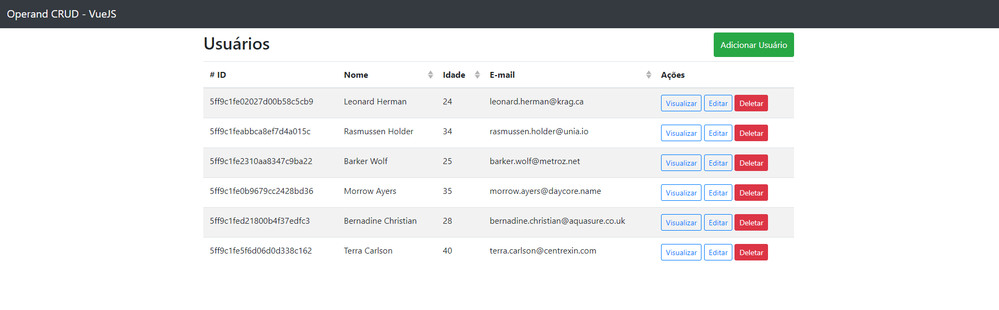

# Operand - Teste Frontend | CRUD

## 📋 Instruções
```
# instalar as dependências
yarn

# iniciar o projeto
yarn dev
```
Se tudo correu certo a aplicação já irar abrir no neu navegador padrão.

## :cherries: Informações
Utilizei a ferramenta https://www.json-generator.com para poder ter dados iniciais a trabalhar em cima deles.

